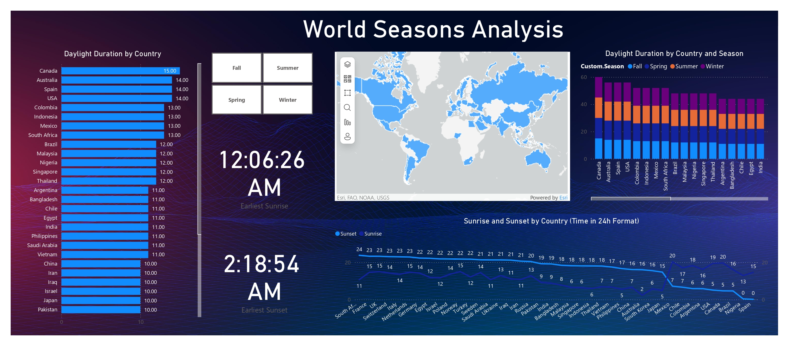

# 🌍 World Seasons Analysis Dashboard in Power BI

This project visualizes global seasonal daylight variations and sun cycles using **Power BI**. It uses a dataset of countries with their **sunrise, sunset times, day length**, and **seasonal daylight durations**. The dashboard helps in understanding how daylight and seasons vary by location across the world.



---

## 🧾 Project Overview

- **Tool Used:** Power BI Desktop
- **Project Type:** Data Visualization Dashboard
- **Objective:** To analyze and visualize daylight durations, sunrise/sunset timings, and seasonal variations across countries using map visuals, charts, and filters.

---

## 🗂️ Dataset Description

The dataset contains the following key columns:

| Column Name         | Description                                 |
|---------------------|---------------------------------------------|
| Country             | Name of the country                         |
| City                | Major city in the country                   |
| Latitude, Longitude | Geolocation used for API calls              |
| Season              | Custom season classification (Fall, etc.)   |
| Sunrise, Sunset     | Sunrise and sunset time in 24h format       |
| Day_length          | Total hours of daylight                     |
| MonthDay            | Month name and day (for line graph x-axis)  |

---

## 🔗 External API Used

We used the **Sunrise-Sunset API** to enrich the data with accurate sunrise and sunset times:

```
https://api.sunrise-sunset.org/json?lat={LATITUDE}&lng={LONGITUDE}&date={DATE}
```

### Steps:
1. Created a table with latitude, longitude, and date.
2. Called the API using **Power Query M Code**:
   ```m
   let
       Source = Excel.CurrentWorkbook(){[Name="InputTable"]}[Content],
       AddURL = Table.AddColumn(Source, "URL", each 
           "https://api.sunrise-sunset.org/json?lat=" & 
           Text.From([Latitude]) & "&lng=" & 
           Text.From([Longitude]) & "&date=" & 
           Text.From([Date])),
       JsonResponse = Table.AddColumn(AddURL, "JSON", each Json.Document(Web.Contents([URL])))
   in
       JsonResponse
   ```
3. Extracted `sunrise`, `sunset`, and `day_length` from the JSON response.

---

## 📊 Visuals Used in the Dashboard

1. **Bar Chart** – *Daylight Duration by Country*  
   - Visualizes which countries have the longest and shortest daylight durations.

2. **Line Chart** – *Sunrise and Sunset by Country (24h Format)*  
   - Plots sunrise and sunset times on the y-axis with country on the x-axis.

3. **Stacked Column Chart** – *Daylight Duration by Country and Season*  
   - Seasonal breakdown of average daylight using `Custom.Season` and `Average Daylight`.

4. **Map Visual** – *World Map with Country Highlights*  
   - Used country names to highlight locations globally (filled maps).
   - ⚠️ Enabled map visuals in `Options > Global > Security > Map and Filled Map visuals`.

---

## ⚙️ Data Transformations

- Used **Power Query** to:
  - Normalize sunrise/sunset times.
  - Extract time values from JSON responses.
  - Convert times into decimal hours for analysis.
  - Replace null values with `NA` or interpolated average.

- Created calculated columns:
  ```DAX
  DayLength_Hours = HOUR([Sunset]) - HOUR([Sunrise]) + 
                    (MINUTE([Sunset]) - MINUTE([Sunrise])) / 60
  ```

- Added slicers for:
  - Country
  - Season
  - MonthDay

---

## 🧠 Improvements and Learnings

### ✅ Key Enhancements
- ✅ Integrated external API for live data.
- ✅ Enabled map visual after troubleshooting **Filled Maps disabled** error.
- ✅ Designed layout for visual balance and minimalism.
- ✅ Used stacked visuals for seasonal comparison.

### 💡 Future Enhancements
- Add time zone-based sunrise/sunset local adjustments.
- Dynamic user input for country/coordinates.
- Deploy via Power BI Service for mobile dashboards.

---

## 📁 Project Structure

```
/WorldSeasonsDashboard/
│
├── WorldSeasonsDashboard.pbix     # Main Power BI project
├── screenshot.png                 # Dashboard preview image
├── README.md                      # Project documentation
└── /data/                         # Raw & transformed Excel/CSV files
```

---

## 🧑‍💻 Author

**Deva Kiran Geddam**  
International Student | Data Enthusiast | Power BI Developer  
Email: [Your Email]  
GitHub: [Your GitHub Handle]  

---

## 📢 License

This project is for educational and demonstrative purposes only.
